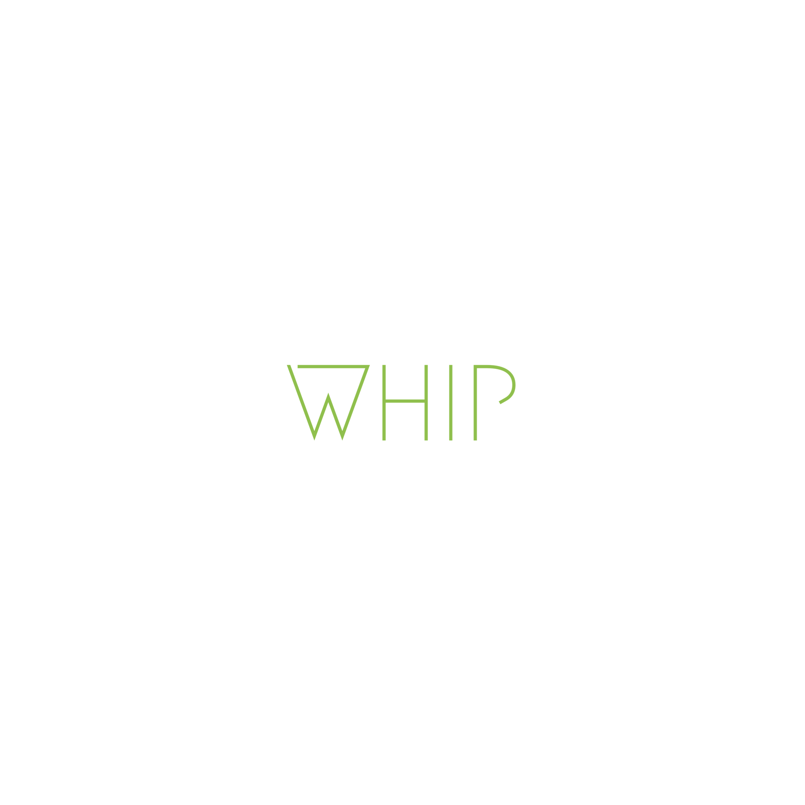

# 8월 17일 중간 보고

---

**- Figma를 이용해 전체적인 앱의 기능과 방향성 토론**

**- 로고 디자인 결정**

**- 구글 맵기능을 활용해서 공원위치 구현**
**- 메인화면(맵 기능이 있는부분) 레이아웃 및 구현(디자인은 미완성)**

**- 로그인 페이지 디자인**

 
**단기계획**

1. 파이어베이스를 이용해 사용자와 로그인페이지 연결
2. 메인페이지 디자인 완성
3. 도그페이지에 대한 회의 후 방향성 결정하기
4. 꾸준한 대화를 통한 앱 완성도 높이기
5. 네비게이션바 완성하기

---
